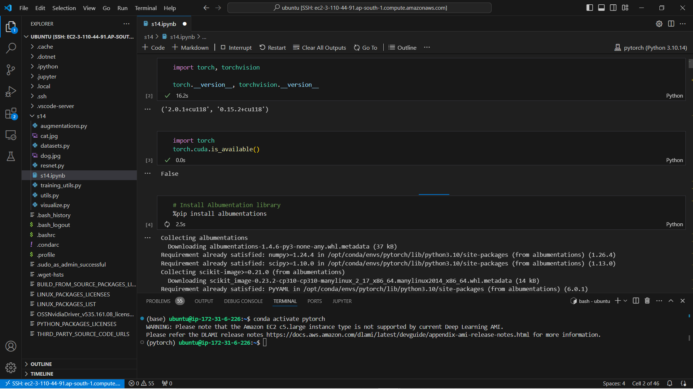
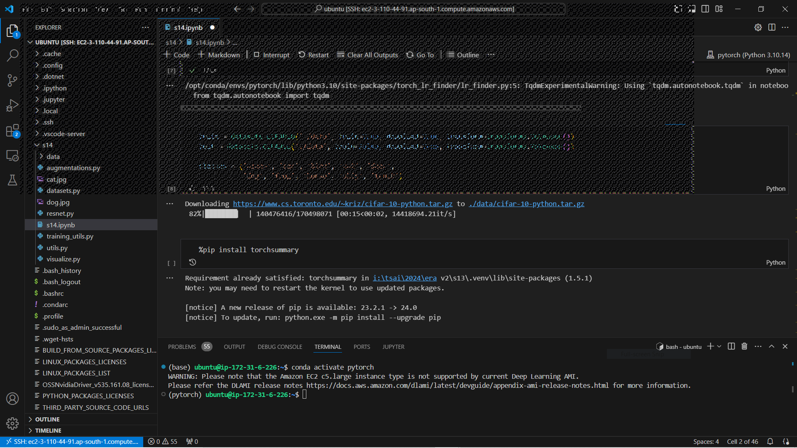
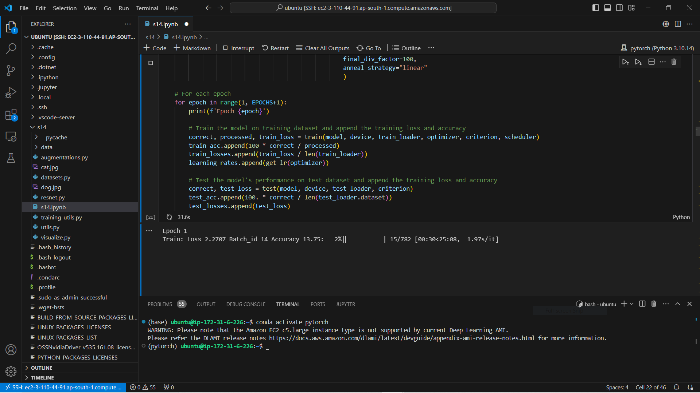
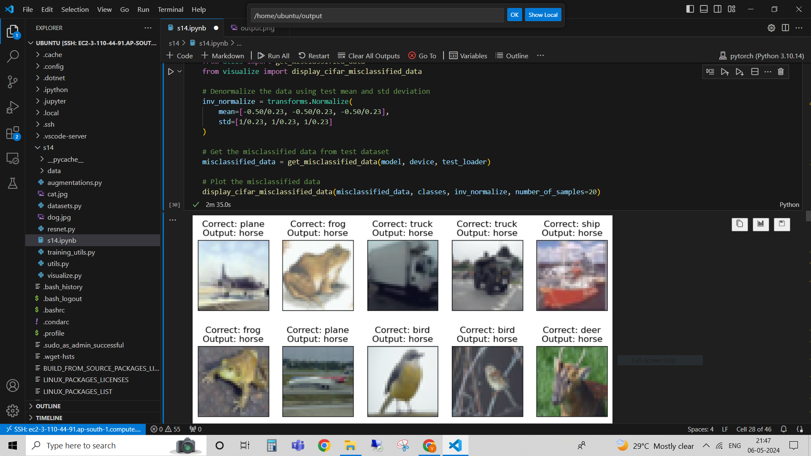
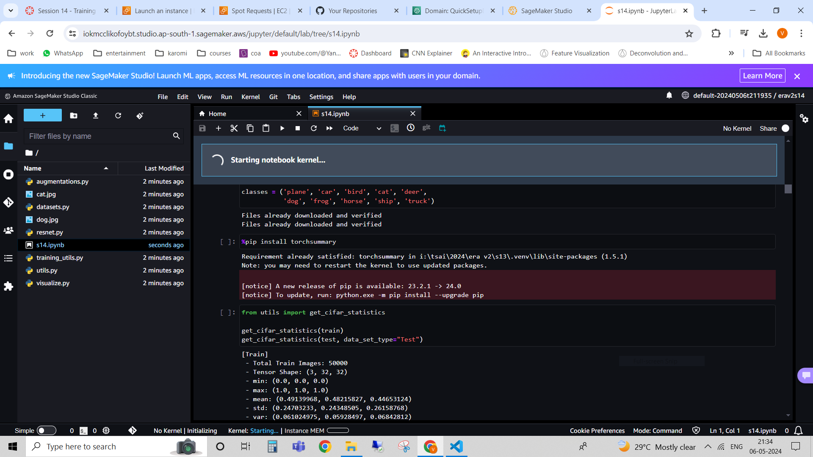
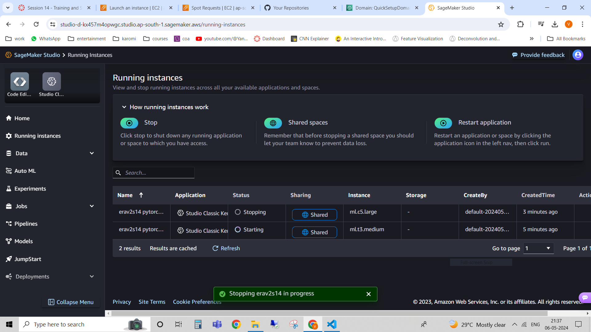

# Assignment 14

# Problem Statement

Train any (pytorch or lightning) model on SageMaker and share the screenshot of the final logs.
Train any (pytorch or lightning) model on EC2 and share the screenshot of the final logs.

This repo contains two parts, 
    
1. One is the training of resnet18 with cifar data in EC2 for 2 epochs and the respective screenshots
2. Another is the training of resnet18 with cifar data in sagemaker for 1 epoch with the respective screenshots

# Results

## EC2 instance training

training images

    

    

    

    

## Sagemaker training

    

    

